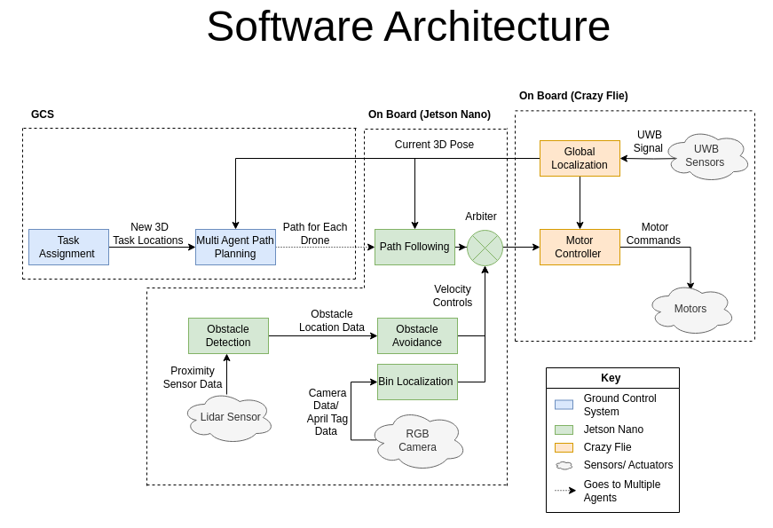
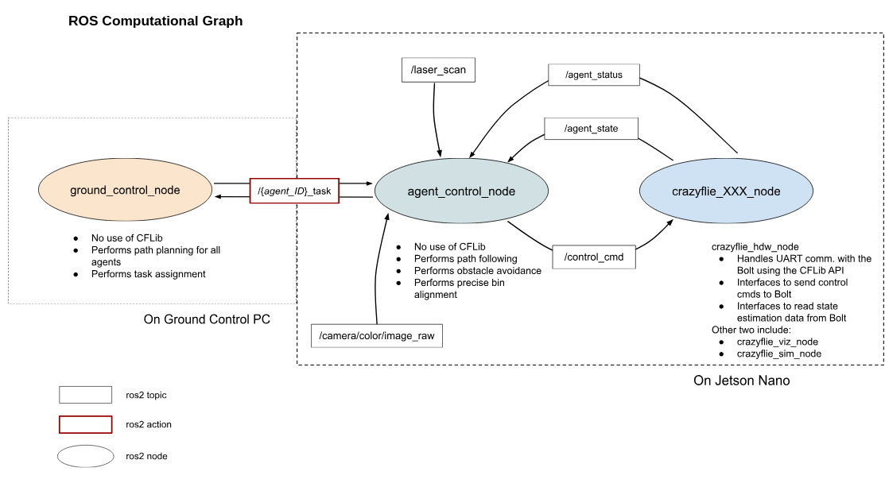

# Hummingbird Robot Software System

This metapackage hosts all the software packages to be deployed on the Hummingbird Robot Fulfillment System.

## Summary of Packages
1. **hbird_navigation**
2. **hbird_interfaces**

## System Setup

### 1. Setup ROS2 workspace
[TBA]

### 2. Clone the repositories
[TBA]

### 3. Install dependencies
[TBA]

